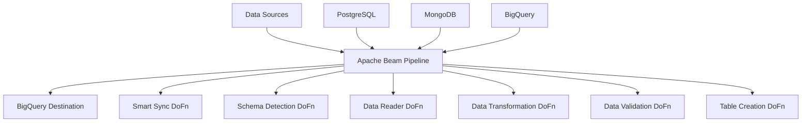
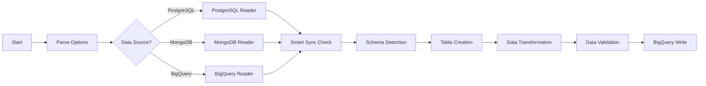

# Implementation Details - Custom Dataflow Pipeline Template

## Table of Contents

1. [Overview](#overview)
2. [Architecture](#architecture)
3. [Technologies & Frameworks](#technologies--frameworks)
4. [Core Components](#core-components)
5. [Data Flow](#data-flow)
6. [Key Algorithms](#key-algorithms)
7. [Configuration Management](#configuration-management)
8. [Error Handling & Logging](#error-handling--logging)
9. [Code Organization](#code-organization)
10. [Extension Guide](#extension-guide)
11. [Performance Considerations](#performance-considerations)
12. [Testing & Debugging](#testing--debugging)
13. [References & Resources](#references--resources)

## Overview

The Custom Dataflow Pipeline Template (`main.py`) is a production-ready Apache Beam pipeline designed for cross-platform data synchronization. The implementation spans **2,175 lines of Python code** and provides intelligent data synchronization capabilities between PostgreSQL, MongoDB, and BigQuery with advanced features like Smart Sync and Auto-Schema detection.

### Key Statistics

- **Lines of Code**: 2,175
- **Classes**: 11 main DoFn classes
- **Functions**: 15+ utility functions
- **Parameters**: 40+ configurable parameters
- **Data Sources**: 3 (PostgreSQL, MongoDB, BigQuery)

## Architecture

### High-Level Architecture



### Component Architecture

The pipeline follows a **modular DoFn-based architecture** where each component is responsible for a specific functionality:

1. **Configuration Layer**: `CustomPipelineOptions` - Parameter management
2. **Source Layer**: Reader DoFns for each data source
3. **Processing Layer**: Transformation, validation, and smart sync logic
4. **Schema Layer**: Auto-detection and mapping components
5. **Destination Layer**: BigQuery table creation and data writing

## Technologies & Frameworks

### Core Technologies

| Technology                | Version | Purpose                               | Documentation                                              |
| ------------------------- | ------- | ------------------------------------- | ---------------------------------------------------------- |
| **Apache Beam**           | 2.66.0+ | Distributed data processing framework | [Apache Beam Docs](https://beam.apache.org/documentation/) |
| **Python**                | 3.9+    | Primary programming language          | [Python Docs](https://docs.python.org/3.9/)                |
| **Google Cloud Dataflow** | Latest  | Managed Apache Beam execution service | [Dataflow Docs](https://cloud.google.com/dataflow/docs)    |

### Database Connectors

| Library                   | Purpose                 | Documentation                                                                          |
| ------------------------- | ----------------------- | -------------------------------------------------------------------------------------- |
| **psycopg2**              | PostgreSQL connectivity | [psycopg2 Docs](https://www.psycopg.org/docs/)                                         |
| **pymongo**               | MongoDB connectivity    | [PyMongo Docs](https://pymongo.readthedocs.io/)                                        |
| **google-cloud-bigquery** | BigQuery operations     | [BigQuery Client Docs](https://cloud.google.com/python/docs/reference/bigquery/latest) |

### Additional Libraries

```python
# Core dependencies from requirements.txt
google-cloud-bigquery==3.4.1
google-cloud-storage==2.7.0
psycopg2-binary==2.9.5
pymongo==4.3.3
pandas==1.5.3
numpy==1.24.2
```

### Apache Beam Concepts Used

1. **PTransforms**: Data transformation operations
2. **DoFn**: Custom processing functions
3. **PCollection**: Distributed data collections
4. **Pipeline**: Main execution container
5. **ValueProvider**: Runtime parameter resolution
6. **Side Inputs**: Auxiliary data for processing

## Core Components

### 1. CustomPipelineOptions Class

**Location**: Lines 72-311  
**Purpose**: Centralized configuration management

```python
class CustomPipelineOptions(PipelineOptions):
    """
    Comprehensive pipeline configuration management.
    Handles 40+ parameters across different data sources.
    """
```

**Key Features**:

- **Type Safety**: Enforced parameter types
- **Default Values**: Sensible defaults for optional parameters
- **Validation**: Built-in parameter validation
- **Documentation**: Inline help text for each parameter

**Critical Parameters**:

```python
# Core identification
data_source: str  # 'postgresql', 'mongodb', 'bigquery'
destination_bigquery_project: str
destination_bigquery_dataset: str
destination_bigquery_table: str

# Smart Sync configuration
enable_smart_sync: str = 'false'
smart_sync_timestamp_column: str = 'updated_at'
postgresql_base_query: str  # Template with {start_timestamp}, {end_timestamp}

# Auto-Schema configuration
enable_auto_schema: str = 'true'
source_table_for_schema: str
partition_field: str = 'updated_at'
clustering_fields: str
```

### 2. Data Reader DoFns

#### PostgreSQLReaderDoFn (Lines 314-453)

**Purpose**: Direct PostgreSQL data reading with enhanced reliability

```python
class PostgreSQLReaderDoFn(DoFn):
    def __init__(self, options: CustomPipelineOptions, query: str):
        # Connection setup and query validation

    def setup(self):
        # Worker-level connection establishment
        # Import libraries in worker context

    def process(self, element):
        # Execute query and yield results
        # Handle BigQuery-compatible data conversion

    def teardown(self):
        # Clean connection closure
```

**Key Implementation Details**:

- **Connection Management**: Per-worker connection pooling
- **Error Handling**: Comprehensive exception management
- **Data Type Conversion**: PostgreSQL → BigQuery compatibility
- **Memory Efficiency**: Streaming result processing

**Critical Code Pattern**:

```python
def setup(self):
    import psycopg2  # Import in worker context
    # Connection string construction
    self._connection = psycopg2.connect(...)

def process(self, element):
    cursor = self._connection.cursor()
    cursor.execute(self.query)

    # BigQuery compatibility transformations
    for row in cursor.fetchall():
        record = dict(zip(column_names, row))
        # Type conversions for BigQuery
        yield self._convert_for_bigquery(record)
```

#### MongoDBReadDoFn (Lines 1461-1630)

**Purpose**: MongoDB document reading with BSON handling

**Key Features**:

- **BSON Processing**: ObjectId → String conversion
- **Query Support**: JSON query string parsing
- **Projection Support**: Field selection optimization
- **Batch Processing**: Configurable batch sizes

#### BigQuery Reader (Integrated)

**Purpose**: BigQuery-to-BigQuery transformations using SQL queries

### 3. Smart Sync Implementation

#### SmartSyncDoFn (Lines 638-895)

**Purpose**: Intelligent timestamp-based synchronization

```python
class SmartSyncDoFn(DoFn):
    def setup(self):
        # Query BigQuery for latest timestamp
        self._latest_timestamp = self._get_latest_timestamp_from_bigquery()
        self._sync_query = self._build_smart_sync_query()
```

**Algorithm Flow**:

1. **Timestamp Detection**:

   ```python
   def _get_latest_timestamp_from_bigquery(self) -> Optional[str]:
       query = f"SELECT MAX({timestamp_column}) as latest_timestamp FROM `{table}`"
       # Execute and return result
   ```

2. **Query Construction**:
   ```python
   def _build_smart_sync_query(self) -> str:
       if self._latest_timestamp:
           start_timestamp = self._latest_timestamp
       else:
           # Handle empty table scenarios
           start_timestamp = '1900-01-01 00:00:00'  # Sync all historical

       end_timestamp = datetime.utcnow().strftime('%Y-%m-%d %H:%M:%S')
       return base_query.format(start_timestamp=start_timestamp, end_timestamp=end_timestamp)
   ```

**Smart Sync Benefits**:

- **Incremental Processing**: Only new data since last run
- **Gap Recovery**: Automatically handles missed time periods
- **Self-Healing**: Adapts to schedule changes
- **Cost Optimization**: Reduces processing volume

### 4. Auto-Schema Detection

#### Schema Detection DoFns

**PostgreSQL Schema Detection** (Lines 977-1112):

```python
def _get_postgresql_schema(self) -> Optional[List[Dict[str, Any]]]:
    query = """
    SELECT column_name, data_type, character_maximum_length,
           is_nullable, column_default, ordinal_position
    FROM information_schema.columns
    WHERE table_schema = %s AND table_name = %s
    ORDER BY ordinal_position
    """
    # Execute and parse schema information
```

**MongoDB Schema Detection** (Lines 1217-1460):

```python
def _analyze_documents_schema(self, documents: List[Dict]) -> List[Dict[str, Any]]:
    # Analyze document structure
    # Infer field types from multiple documents
    # Handle nested objects and arrays
```

**BigQuery Schema Detection** (Lines 1113-1216):

```python
def _get_bigquery_schema(self) -> Optional[List[Dict[str, Any]]]:
    table_ref = self._client.get_table(f"{project}.{dataset}.{table}")
    # Extract schema from existing table
```

#### BigQueryTableCreationDoFn (Lines 1631-1876)

**Purpose**: Intelligent BigQuery table creation with optimization

```python
def _create_bigquery_table(self):
    schema_fields = self._map_schema_to_bigquery(self._source_schema)

    # Table configuration with optimization
    table = bigquery.Table(table_ref, schema=schema_fields)

    # Partitioning setup
    if partition_field:
        table.time_partitioning = bigquery.TimePartitioning(
            type_=bigquery.TimePartitioningType.DAY,
            field=partition_field
        )

    # Clustering setup
    if clustering_fields:
        table.clustering_fields = clustering_fields.split(',')
```

**Type Mapping Logic**:

```python
def _map_schema_to_bigquery(self, source_schema):
    type_mapping = {
        'character varying': 'STRING',
        'integer': 'INTEGER',
        'timestamp without time zone': 'TIMESTAMP',
        'jsonb': 'JSON',
        'boolean': 'BOOLEAN',
        # ... comprehensive mapping
    }
```

## Data Flow

### 1. Pipeline Initialization

```python
def run_pipeline(argv=None):
    # 1. Parse command line arguments
    pipeline_options = PipelineOptions(argv)
    custom_options = pipeline_options.view_as(CustomPipelineOptions)

    # 2. Create pipeline
    with beam.Pipeline(options=pipeline_options) as pipeline:
        # 3. Build processing graph
```

### 2. Processing Flow



### 3. Parallel Processing Streams

The pipeline supports multiple parallel data streams:

```python
# Initialize data collections
data_collections = []

# PostgreSQL stream
if 'postgresql' in data_sources:
    postgresql_data = (
        pipeline
        | 'Create PostgreSQL Trigger' >> beam.Create([None])
        | 'Read PostgreSQL' >> beam.ParDo(PostgreSQLReaderDoFn(custom_options, query))
        | 'Transform PostgreSQL Data' >> beam.ParDo(DataTransformationDoFn(...))
    )
    data_collections.append(postgresql_data)

# MongoDB stream
if 'mongodb' in data_sources:
    mongodb_data = (
        pipeline
        | 'Create MongoDB Trigger' >> beam.Create([None])
        | 'Read MongoDB' >> beam.ParDo(MongoDBReadDoFn(custom_options))
    )
    data_collections.append(mongodb_data)

# Combine all streams
if len(data_collections) > 1:
    combined_data = tuple(data_collections) | 'Combine Sources' >> beam.Flatten()
else:
    combined_data = data_collections[0]
```

## Key Algorithms

### 1. Smart Sync Algorithm

**Problem**: Efficiently sync only new data without duplicates or gaps

**Solution**:

1. Query destination table for `MAX(timestamp_column)`
2. Use result as `start_timestamp` for source query
3. Use current time as `end_timestamp`
4. Handle edge cases (empty table, gaps)

**Time Complexity**: O(1) for timestamp detection + O(n) for data processing where n = new records

**Space Complexity**: O(1) for algorithm overhead + O(m) for batch processing where m = batch size

### 2. Auto-Schema Detection Algorithm

**Problem**: Automatically detect and map schemas across different database systems

**Solution**:

1. **Source Schema Detection**: Query information_schema or analyze documents
2. **Type Mapping**: Apply database-specific type conversions
3. **Optimization**: Add partitioning and clustering based on data patterns
4. **Validation**: Ensure BigQuery compatibility

**Algorithm Complexity**:

- PostgreSQL: O(c) where c = number of columns
- MongoDB: O(d × f) where d = sample documents, f = fields per document
- BigQuery: O(s) where s = schema fields

### 3. Data Transformation Pipeline

**Pattern**: Chain of Responsibility with Apache Beam ParDo transforms

```python
transformed_data = (
    raw_data
    | 'Transform' >> beam.ParDo(DataTransformationDoFn(transformation_config))
    | 'Validate' >> beam.ParDo(DataValidationDoFn())
    | 'Sanitize' >> beam.Map(sanitize_for_bigquery)
)
```

## Configuration Management

### Parameter Resolution Pattern

```python
def safe_get_param(param):
    """
    Safely resolve ValueProvider parameters.
    Handles both runtime and compile-time values.
    """
    if param is None:
        return None
    if hasattr(param, 'get'):
        return param.get()  # Runtime resolution
    return param  # Compile-time value
```

**Usage Pattern**:

```python
def setup(self):
    # Always use safe_get_param in worker context
    host = safe_get_param(self.options.postgresql_host)
    port = safe_get_param(self.options.postgresql_port)
```

### Configuration Inheritance

```python
class CustomPipelineOptions(PipelineOptions):
    @classmethod
    def _add_argparse_args(cls, parser):
        # PostgreSQL parameters
        parser.add_argument('--postgresql_host', type=str, help='...')

        # Smart Sync parameters
        parser.add_argument('--enable_smart_sync', type=str, default='false')

        # Auto-Schema parameters
        parser.add_argument('--enable_auto_schema', type=str, default='true')
```

## Error Handling & Logging

### Exception Handling Strategy

**Pattern**: Fail-fast with graceful degradation

```python
def process(self, element):
    try:
        # Primary processing logic
        result = self._process_data(element)
        yield result
    except SpecificException as e:
        # Handle specific errors with recovery
        logger.warning(f"Recoverable error: {e}")
        yield self._fallback_processing(element)
    except Exception as e:
        # Log and re-raise unrecoverable errors
        logger.error(f"Fatal error processing element: {e}")
        raise
```

### Logging Framework

**Structured Logging**:

```python
import logging
logger = logging.getLogger(__name__)

# Different log levels for different scenarios
logger.info(f"Processing {row_count} records from PostgreSQL")
logger.warning(f"Query executed but returned no result set")
logger.error(f"Error reading from PostgreSQL: {e}")
```

**Log Aggregation**: Logs are automatically collected by Google Cloud Logging

### Connection Management

**Pattern**: Context manager with automatic cleanup

```python
def setup(self):
    # Establish connections in worker context
    self._connection = psycopg2.connect(...)

def teardown(self):
    # Ensure clean shutdown
    if self._connection:
        self._connection.close()
```

## Code Organization

### File Structure

```
main.py (2,175 lines)
├── Imports & Utilities (Lines 1-71)
├── Configuration Classes (Lines 72-311)
├── Data Reader DoFns (Lines 314-637)
├── Smart Sync Implementation (Lines 638-895)
├── Utility Functions (Lines 896-976)
├── Schema Detection DoFns (Lines 977-1630)
├── Table Creation DoFn (Lines 1631-1876)
└── Main Pipeline Function (Lines 1877-2175)
```

### Design Patterns Used

1. **Strategy Pattern**: Different readers for different data sources
2. **Factory Pattern**: Dynamic DoFn creation based on configuration
3. **Template Method**: Common processing patterns with source-specific implementations
4. **Observer Pattern**: Logging and monitoring throughout the pipeline
5. **Command Pattern**: Parameterized pipeline operations

### Naming Conventions

- **Classes**: PascalCase with descriptive suffixes (`PostgreSQLReaderDoFn`)
- **Functions**: snake_case with verb prefixes (`_get_latest_timestamp`)
- **Variables**: snake_case with descriptive names (`smart_sync_timestamp_column`)
- **Constants**: UPPER_SNAKE_CASE (`DEFAULT_BATCH_SIZE`)

## Extension Guide

### Adding New Data Sources

1. **Create Reader DoFn**:

```python
class NewSourceReaderDoFn(DoFn):
    def __init__(self, options: CustomPipelineOptions):
        self.options = options

    def setup(self):
        # Initialize connections
        pass

    def process(self, element):
        # Read and yield data
        pass
```

2. **Add Configuration Parameters**:

```python
# In CustomPipelineOptions._add_argparse_args()
parser.add_argument('--newsource_host', type=str, help='...')
parser.add_argument('--newsource_port', type=str, help='...')
```

3. **Integrate into Pipeline**:

```python
# In run_pipeline()
if 'newsource' in data_sources:
    newsource_data = (
        pipeline
        | 'Create NewSource Trigger' >> beam.Create([None])
        | 'Read NewSource' >> beam.ParDo(NewSourceReaderDoFn(custom_options))
    )
    data_collections.append(newsource_data)
```

### Adding New Transformations

```python
class CustomTransformDoFn(DoFn):
    def __init__(self, custom_config):
        self.config = custom_config

    def process(self, element):
        # Apply custom transformation logic
        transformed = self._apply_custom_logic(element)
        yield transformed
```

### Extending Smart Sync

```python
class AdvancedSmartSyncDoFn(SmartSyncDoFn):
    def _build_smart_sync_query(self) -> str:
        # Override with advanced logic
        base_query = super()._build_smart_sync_query()
        # Add custom enhancements
        return self._enhance_query(base_query)
```

## Performance Considerations

### Memory Management

- **Streaming Processing**: Data processed in small batches
- **Connection Pooling**: Reuse database connections across elements
- **Lazy Loading**: Import heavy libraries only in worker context

### Optimization Strategies

1. **Batch Size Tuning**:

```python
# Configurable batch sizes for different sources
DEFAULT_BATCH_SIZE = 1000
mongodb_batch = safe_get_param(custom_options.batch_size) or DEFAULT_BATCH_SIZE
```

2. **Parallel Processing**:

```python
# Multiple data sources processed in parallel
data_collections = []  # Each source creates separate PCollection
# Combined at the end for unified processing
```

3. **BigQuery Optimizations**:

```python
# Partitioning for query performance
table.time_partitioning = bigquery.TimePartitioning(
    type_=bigquery.TimePartitioningType.DAY,
    field=partition_field
)

# Clustering for query optimization
table.clustering_fields = clustering_fields.split(',')
```

### Scalability Features

- **Auto-scaling**: Dataflow automatically scales workers
- **Resource Configuration**: Configurable worker machine types
- **Network Optimization**: VPC and subnet configuration for private networks

## Testing & Debugging

### Local Testing

```bash
# Use DirectRunner for local testing
python scripts/run_local_test.py --test-type=postgresql
```

### Debug Logging

```python
# Enable debug logging
logger.setLevel(logging.DEBUG)
logger.debug(f"Processing element: {element}")
```

### Common Debugging Patterns

1. **Element Counting**:

```python
| 'Count Elements' >> beam.combiners.Count.Globally()
| 'Log Count' >> beam.Map(lambda count: logging.info(f"Processed {count} elements"))
```

2. **Data Sampling**:

```python
| 'Sample Data' >> beam.combiners.Sample.FixedSizeGlobally(10)
| 'Log Sample' >> beam.Map(lambda sample: logging.info(f"Sample: {sample}"))
```

3. **Error Collection**:

```python
# Use tagged outputs for error handling
result = (
    data
    | 'Process with Error Handling' >> beam.ParDo(ProcessingDoFn()).with_outputs('errors', main='success')
)
success_data = result.success
errors = result.errors
```

## References & Resources

### Official Documentation

1. **Apache Beam Programming Guide**: https://beam.apache.org/documentation/programming-guide/
2. **Apache Beam Python SDK**: https://beam.apache.org/releases/pydoc/current/
3. **Google Cloud Dataflow**: https://cloud.google.com/dataflow/docs
4. **BigQuery Python Client**: https://cloud.google.com/python/docs/reference/bigquery/latest

### Database Connectors

1. **psycopg2 Documentation**: https://www.psycopg.org/docs/
2. **PyMongo Documentation**: https://pymongo.readthedocs.io/
3. **BigQuery SQL Reference**: https://cloud.google.com/bigquery/docs/reference/standard-sql/

### Design Patterns & Best Practices

1. **Apache Beam Best Practices**: https://beam.apache.org/documentation/patterns/overview/
2. **Google Cloud Architecture Framework**: https://cloud.google.com/architecture/framework
3. **Python Design Patterns**: https://refactoring.guru/design-patterns/python

### Performance & Optimization

1. **Dataflow Performance Guide**: https://cloud.google.com/dataflow/docs/guides/deploying-a-pipeline#performance-and-cost-optimization
2. **BigQuery Best Practices**: https://cloud.google.com/bigquery/docs/best-practices-performance-overview
3. **Apache Beam Performance**: https://beam.apache.org/documentation/programming-guide/#performance-and-optimization

### Monitoring & Debugging

1. **Dataflow Monitoring**: https://cloud.google.com/dataflow/docs/guides/using-monitoring-interface
2. **Cloud Logging**: https://cloud.google.com/logging/docs
3. **Error Reporting**: https://cloud.google.com/error-reporting/docs

---

**Document Version**: 1.0.0  
**Last Updated**: January 2025  
**Maintainer**: Data Engineering Team

This documentation provides a comprehensive technical reference for understanding, maintaining, and extending the Custom Dataflow Pipeline Template. For specific implementation questions, refer to the inline code comments and the extensive logging throughout the pipeline.
